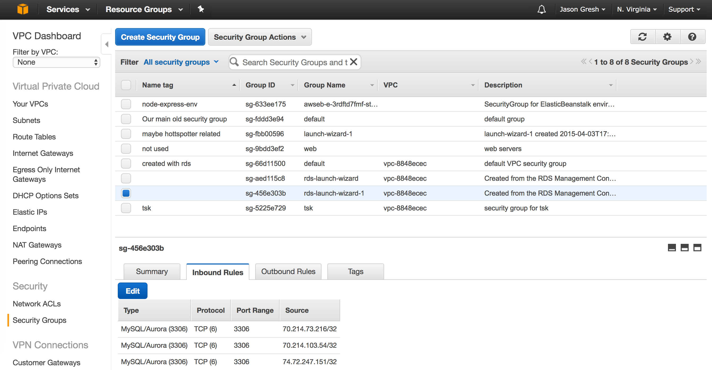

# Introduction to SQL

## Objective

The goal and scope of this to expose the student to SQL through one example environment (AWS) 
and software package (Sequel Pro). The basics of the language are introduced and a simple 
relational problem is worked through.

## Definitions 

### SQL

SQL (Structured Query Language) is a declarative language used to interact with a relational management 
database system (RDBMS). Its statements are divided into two categories, DML and DDL, Data Manipulation
Language and Data Definition Language, respectively. Both DDL and DML statements are sent to the database
in the same way.

### Statement

Each individual unit of SQL is referred to as a statement. It can span more than one line and often does
for readability. 

### Declarative

SQL is a declarative language. This means that its statements are written to describe/declare what the results
should be, without any code defining _how_ the results are accomplished. (Swift, and the majority of languages
by contrast, are imperative languages that allow for the expression of step-by-step algorithmic instructions).

### DDL

DDL, Data Definition Language, is the subset of SQL statements that operate on the structure of the database. 
These operations are done first, chronologically, as DML depends on tables existing before it can be run. It is
possible and common even, to return to the structure of the database and modify it. In more complicated environments
DDL work might be the domain of a DBA (database administrator) and access to it restricted in order to prevent

### DML

DML, Data Manipulation Language, is the subset of SQL statements that read and write data from and to the 
database. Generally, this is where more time is spent by the developer.


### CRUD

CRUD: Create, Read, Update and Delete. Create, here, corresponds not to SQL's DDL statement ```CREATE```, but 
instead to its ```INSERT``` statement

### Client-Server

Most of the time SQL database is accessed using a client-server architecture. The SQL database is a 
central server that a variety of clients connect to and send SQL, listening for responses. One 
notable and familiar exception is the SQLite database that (usually, and by default) backs Core Data. 
This lesson focuses on SQL in a client-server architecture.

## Environment 

### Popular SQL Databases

* MySQL
* PostgreSQL
* Oracle
* SQL Server
* SQLite

### Server - AWS RDS

AWS (Amazon Web Services) is a large suite of cloud computing products, with a range of high level
and low level interfaces to computing resources. Firebase, a Google product, as a point of reference only
offers a few high level features (authentication, a NoSQL database and storage) using a SaaS model.
AWS has introduced these kinds of high level products but also has basic old-school services that 
allow you to control a virtual machine or a database.

Amazon's database product is named RDS, and we'll be using it today. We'll use Aurora or MySQL 
depending on which one is free. Aurora is a cheaper MySQL clone which is more than enough for 
our purposes or for anything you're likely to build on your own.


#### Security

A lot of what is difficult about AWS is security related. AWS uses VPC (Virtual Private Cloud)
to isolate logical networks. Being a client-server environment there needs to be security around
who can access the database. The most tangible upshot of this is that you’ll have to make the db 
accessible from your network. When you first set up your database there's an option to allow access
from your network at the time but your network will change as you move and it may even change if you don't.

In order to open a new network to the database, find the security group and add a new inbound rule with 
your current IP:



## Tools

There are myriad SQL front-end tools. Here, we will use Sequel Pro https://www.sequelpro.com/.

## Problem/Demo

Game of Thrones is back. Let's explore how we'd model and store 

## Normalization

> Data Duplication is the devil

Normalization is an enormous topic tucked within the already enormous topic of SQL. Suffice to say for our
scope that it is the prinicple and process of de-duplicating and organizing data through relationships. 
This is the "relational" part of RDBMS.

Relationships
1:1
1:∞
∞:∞

These three have overlapping meanings
database
schema
user

DDL Data Definition Language
create, drop, alter
create database got;
use got;


DML Data Manipulation Language
select, insert, update, delete

tables
queries
joins


## Integrity 

SQL gives us very powerful tools to ensure the integrity of the data. Control 
dangling references, transations.

Consider Firebase, specifically during the final. Each client that connects to Firebase can
do whatever it wants to it.


## Efficiency

Indexing

